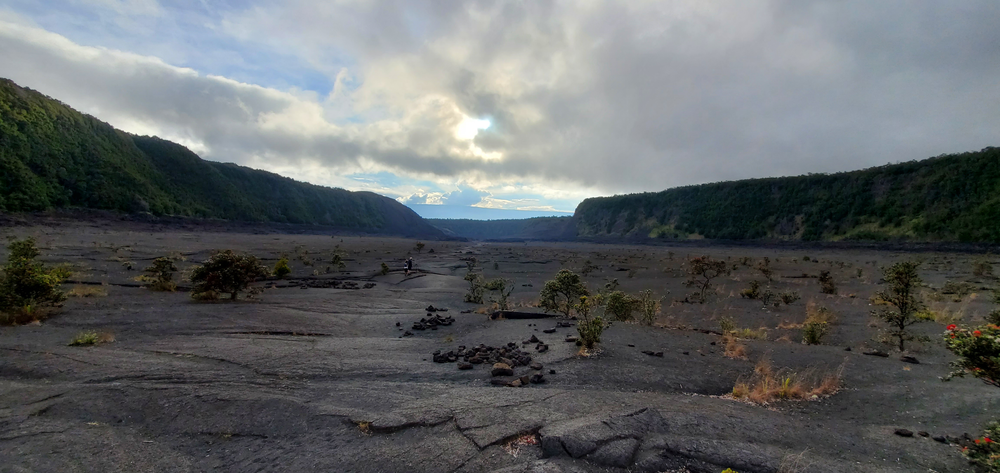
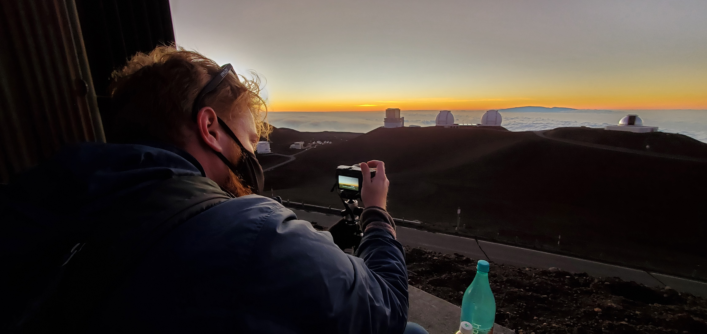

Hawaii's landscapes inspire, with it's vibrant natural foliage and it's ecletic urban scene. I hope to learn more and grow to further appreciate Hawaii in all it's nuances and traditions through the art of photography.

Hawaii's natural beauty and urban scene offer photographers a captivating canvas to explore. From the lush, emerald green valleys of Kauai to the dramatic volcanic landscapes of the Big Island, the islands are a paradise for nature enthusiasts. The vibrant colors of tropical flowers, the crystal-clear waters teeming with marine life, and the fiery sunsets over the Pacific Ocean provide endless opportunities for breathtaking shots.

In contrast to its natural wonders, Hawaii's urban scene is a blend of tradition and modernity. The historic streets of Honolulu's Chinatown exude a timeless charm, while the bustling cityscape of Waikiki Beach offers a lively, cosmopolitan vibe. The fusion of Hawaiian culture with contemporary influences creates a dynamic backdrop for urban photography.

Whether you're capturing the serenity of a secluded beach at sunrise or the energy of a local luau, Hawaii's diverse landscapes and cultures provide an endless source of inspiration for photographers seeking to capture the unique beauty of these islands.

 Ocean Overlook. Oahu, Hawaii 2022

 The Caldera. Big Island, Hawaii 2022

 Sunset at Mt. Mauna Kea. Big Island, Hawaii 2022

