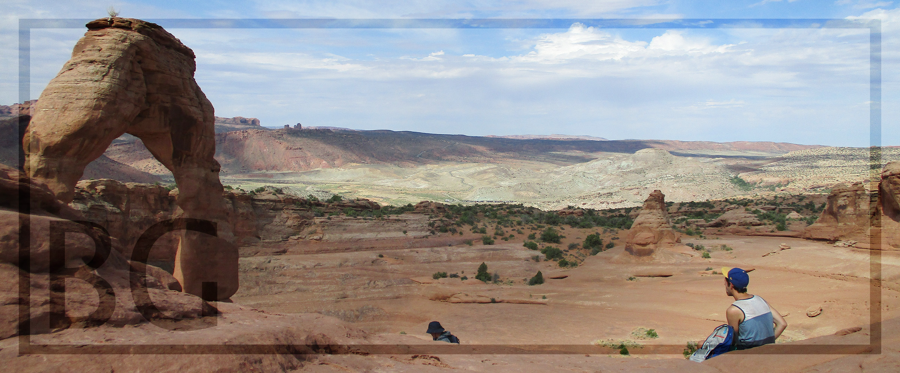

In the rise of technology and amidst the growing concerns about mental health, hiking offers a profound opportunity to unplug, unwind, and rediscover the healing embrace of the natural world. It is a reminder that our connection with nature is not only a source of solace but a catalyst for positive change in our relationship with the environment. By immersing ourselves in the great outdoors, we not only find serenity and clarity but also awaken a deep commitment to preserving the beauty and wonder of the world we call home.

Choosing to hike in support of spreading awareness about the environment is a powerful way to combine the joy of outdoor exploration with a meaningful cause. Unique ecosystems around the world are under constant threat from climate change, pollution, and habitat destruction, making it essential to educate others about the urgent need for conservation. Each step taken on the hiking trails becomes a statement of solidarity with the preservation of these breathtaking landscapes and a call to action for responsible stewardship. By sharing the beauty and fragility of our environment through hiking, we can inspire others to join the effort in safeguarding natural treasures for generations to come.

 Arches National Park, Utah 2020
